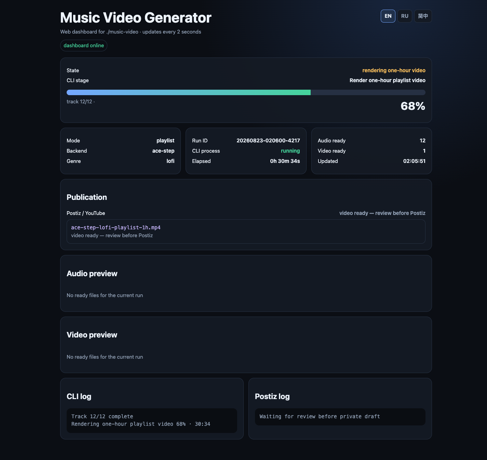
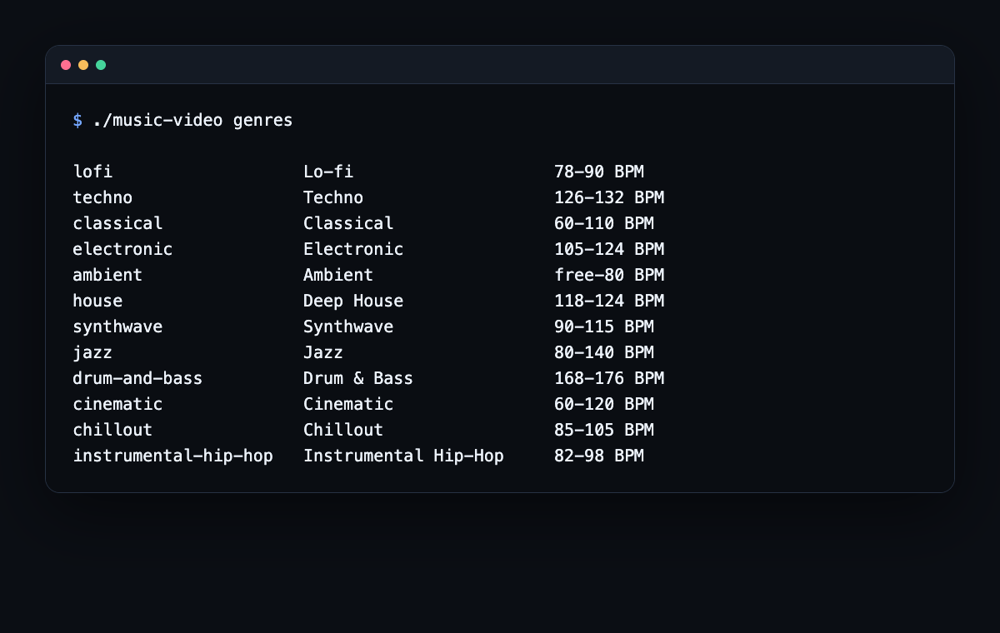
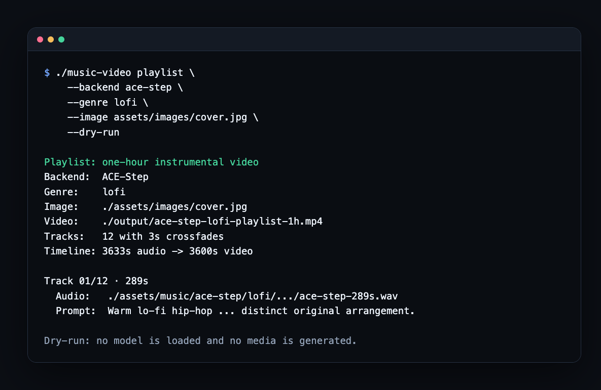

# Music Video Generator

[English](README.md) · [Русский](README.ru.md) · [简体中文](README.zh-CN.md)

只需在终端输入一段音乐描述，即可生成纯器乐曲目，或制作完整的一小时播放列表视频。您可以选择流派和本地模型、查看真实进度，并在需要时通过 Postiz 把成品保存为私密 YouTube 草稿。

本项目坚持 code-only 和 local-first：音乐、图片、模型权重、虚拟环境、日志和真实 API 密钥都不会进入 Git。

## 快速开始：从克隆到第一次 dry-run

### 1. 打开项目并检查当前环境

```bash
git clone git@github.com:Arnon-hs/music-video.git
cd music-video

./music-video doctor
./music-video genres
```

`doctor` 会检查 FFmpeg 和模型环境。如果某个 backend 显示缺失，只需安装您真正想用的那个，不必一次安装全部模型。

### 2. 先预览一个小任务

```bash
./music-video generate \
  --backend ace-step \
  --genre lofi \
  --duration 60 \
  --dry-run
```

Dry-run 会显示 prompt、输出路径和实际命令，但不会加载模型或生成媒体。

### 3. 正式运行，或使用终端向导

确认计划后删除 `--dry-run`，也可以启动交互式流程：

```bash
./music-video
```

## 选择最适合您的入口

| 我想要…… | 从这里开始 | 得到的结果 |
|---|---|---|
| 不安装模型先看看 | `./music-video genres` 和 `--dry-run` | 已验证的命令和 prompt |
| 生成一首纯器乐曲目 | `./music-video generate ...` | `assets/music` 中的 WAV 或 MP3 |
| 给曲目添加封面 | 加上 `--video`，图片放入 `assets/images` | `output` 中的 MP4 |
| 制作一小时混音 | `./music-video playlist ...` | 同流派的多首不同曲目和 3600 秒 MP4 |
| 从手机或浏览器查看 | `./music-video web` | 实时 CLI 进度、日志、预览和 Postiz draft 状态 |
| 让 agent 操作 CLI | 使用下面的 prompt 和 skill | 有边界、可观察的工作流 |
| 准备 YouTube 上传 | 先运行 Postiz `--dry-run` | 可供人工检查的私密草稿 |

## 可直接交给 coding agent 的请求

替换尖括号中的内容，然后粘贴到 Codex、Claude Code 或其他本地 agent：

```text
在此仓库中工作，并让所有生成文件保留在本地。
1. 运行 ./music-video doctor --json 和 ./music-video genres --json。
2. 为 <genre> 选择 ready: true 的 backend。
3. 使用 <backend> 准备 <60 秒曲目 | 一小时播放列表视频>。
   只有需要视频时才使用 assets/images/<cover-file>。
4. 先展示完整的 --dry-run。未经我确认，不要下载模型或媒体。
5. 确认后只运行一个有明确边界的任务，并报告真实的
   ./music-video status --json。
6. 用 ffprobe 检查时长和媒体流，并让我试听/检查。
7. 不要上传或发布。如果之后使用 Postiz，先运行 --dry-run，
   并且只创建私密草稿。
```

## 连接到 Codex 工作会话

仓库已包含 `.agents/skills/music-video-generator` skill。它告诉 agent 如何检查 backend、要求 dry-run、生成曲目/播放列表、验证媒体、使用远程 GPU，以及确保 Postiz 始终停留在私密草稿阶段。

### 只在本仓库使用——无需安装

1. 在 Codex 中把仓库根目录作为 workspace 打开。
2. 从该目录创建新任务；Codex 会发现 `.agents/skills` 下的 repo-scoped skill。
3. 显式输入 `$music-video-generator`，或直接用自然语言请求一首曲目/播放列表。

```text
Use $music-video-generator. Check doctor and genres, then show a dry-run
for a one-hour lo-fi playlist with cover.jpg. Do not install, download,
upload, or publish anything yet.
```

### 在所有 Codex workspace 中使用

```bash
./scripts/install_codex_skill.sh
```

安装脚本会创建 `~/.agents/skills/music-video-generator` 符号链接，并拒绝覆盖已有路径。如果 skill 没有出现，请重启客户端。断开时只删除链接：

```bash
unlink ~/.agents/skills/music-video-generator
```

详情请参阅 [OpenAI 官方 skills 指南](https://developers.openai.com/codex/skills/)。目前单仓库工作流不需要单独的 app/plugin；只有在需要公开安装、多个 skills 或打包 connectors 时，plugin 才更合适。

Skill 不会自行下载模型或租用 GPU。此类操作会产生费用或改变外部状态，因此必须获得用户明确确认。

## 优势与限制

| 优势 | 限制 |
|---|---|
| 一个 CLI 支持四个 backend 和 12 个纯器乐流派 | 模型代码和权重需要单独安装 |
| dry-run、进度、JSON status 和可恢复的播放列表 | 生成速度可能很慢，并消耗大量内存 |
| 单曲视频或使用不裁剪封面的精确一小时视频 | 不是时间线编辑器：只有一张静态图片，没有动画场景 |
| 每个 prompt 都追加无声乐和原创性约束 | 模型仍可能产生类似人声的声音或 Content ID 风险 |
| 本地文件与私密 Postiz 草稿 | 尚无内置的远程音乐生成 HTTP API |

## 本机、RunPod 还是 API？

| 模式 | 现在可用？ | 工作方式 |
|---|---|---|
| 本地 Mac/Linux | 是 | 本地安装一个 backend，直接运行 CLI |
| RunPod Pod 或 GPU VPS | 是 | 把它当作远程 Linux 工作站：SSH、持久磁盘、同一个 CLI，验证后复制回本机 |
| RunPod Serverless 生成 API | 暂未提供 | 仍需要容器镜像、handler、产物存储、身份验证和队列控制 |
| LLM API | 自行接入 | LLM 只生成 prompt，再通过 `--prompt` 传入；本项目不保存 LLM 密钥 |
| Pexels API | 可选 | 查找候选图片，下载仍需明确确认 |
| Postiz API | 可选 | 接收成品 MP4 并创建私密草稿，不负责生成音乐 |

RunPod 的简短流程：从 PyTorch 模板创建普通 GPU Pod，把持久存储挂载到 `/workspace`，通过 SSH 登录，克隆仓库，只安装一个 backend，然后先运行 `doctor` 和 `--dry-run`。长任务放在 `tmux` 中，通过 `./music-video status --json` 查看进度；使用 `ffprobe` 验证文件，再用 `scp` 下载。确认结果已经安全复制后再停止 GPU；在确认持久文件之前不要删除 Pod 或 volume。

完整命令、存储建议，以及 Vast.ai/通用 NVIDIA VPS 方案请查看[远程 GPU 指南](docs/REMOTE_GPU.md)。普通 Pod/VPS 是目前推荐的入口，因为现有适配器依赖本地文件和长时间运行的进程。要把 RunPod Serverless 变成真正的 API，还需要单独实现 worker。

## 许可证与权利

Copyright 2026 Vasilii Bereznikov.

本项目采用 [PolyForm Noncommercial License 1.0.0](LICENSE)。保留许可证和版权声明后，可以为许可的非商业目的使用、研究、修改和向社区分享代码。

这是面向社区的 source-available 许可证，但不是 OSI 认可的开源许可证。项目没有采用 Apache-2.0，因为它允许商业使用。商业使用需要另行取得所有者许可。

模型、权重、API、图片和生成结果各有自己的许可证和权利边界。发布前请检查所选模型和每个媒体资产；本项目的代码许可证不会自动解决模型权重或生成音乐的发布权利。

## 常用 CLI 示例

```bash
./music-video --help
./music-video genres
./music-video genres --json
./music-video doctor
./music-video doctor --json
./music-video status
./music-video status --json
./music-video web
```

使用 ACE-Step 生成 techno：

```bash
./music-video generate \
  --backend ace-step \
  --genre techno \
  --duration 60
```

生成 classical 音乐并制作视频：

```bash
./music-video generate \
  --backend stable-audio3 \
  --genre classical \
  --duration 120 \
  --video
```

仅验证命令，不启动模型：

```bash
./music-video generate \
  --backend diffrhythm2 \
  --genre drum-and-bass \
  --duration 180 \
  --dry-run
```

使用 LLM 提供的自定义 prompt：

```bash
./music-video generate \
  --backend ace-step \
  --genre electronic \
  --duration 90 \
  --prompt "Instrumental modular electronic music, 118 BPM, evolving polyrhythms, deep bass, no vocals, no speech, original melody"
```

### 一小时播放列表视频

将拥有使用权的封面图片放入 `assets/images`，先检查完整计划，再启动生成：

```bash
./music-video playlist \
  --backend ace-step \
  --genre lofi \
  --image assets/images/cover.jpg \
  --dry-run

./music-video playlist \
  --backend ace-step \
  --genre lofi \
  --image assets/images/cover.jpg \
  --force-cpu
```

该命令会生成同一流派的多首独立曲目，每首曲目具有不同的时长、seed 和编曲 prompt 变化。随后使用三秒 crossfade 连接曲目，并渲染总时长恰好为 3600 秒的 H.264/AAC 视频。所选图片会完整适配到 1280x720 画面并添加边框，不会裁剪或拉伸。

CLI 会根据 backend 的时长限制自动选择曲目数量：MusicGen/ACE-Step 通常为 12 首，Stable Audio 3 为 18 首，DiffRhythm 2 为 20 首。可使用 `--tracks` 修改数量，使用 `--crossfade` 调整过渡时长，使用 `--prompt` 设置整个专辑的风格，或使用 `--output` 指定最终路径。无效组合会在模型启动前被拒绝。

CLI 会通过 `ffprobe` 检查已有曲目的时长并复用有效文件，因此中断的播放列表任务可以继续。DiffRhythm/Stable Audio 在未明确指定 `--allow-downloads` 时保持 offline mode；MusicGen 则保留独立的手动 `DOWNLOAD_MODEL` 确认。CLI 也会在报告成功前检查最终视频的时长。

如需引导式流程，请不带参数运行 `./music-video`，然后选择 **One-hour playlist video**。可通过 `./music-video status` 和 `./music-video status --json` 查看进度。检查完整 MP4 后，请先使用现有的 Postiz `--dry-run` 流程，再创建私密 YouTube 草稿。

主要参数：

| 参数 | 用途 |
|---|---|
| `--backend` | `musicgen`、`ace-step`、`diffrhythm2` 或 `stable-audio3` |
| `--genre` | 流派 slug；支持别名 `classic`、`lo-fi`、`dnb` |
| `--duration` | 以秒为单位的时长，并校验 backend 的限制 |
| `--seed` | 用于可复现生成的 seed |
| `--prompt` | 最多 2000 个字符且不含控制字符的风格描述；系统仍会追加禁止人声的限制 |
| `--video` | 音乐生成后制作 MP4 |
| `--force-cpu` | 在 backend 支持时禁用 GPU/MPS |
| `--allow-downloads` | 明确允许 DiffRhythm/Stable Audio 下载缺失的模型 |
| `--dry-run` | 显示 prompt、路径和命令，但不启动模型 |

流派配置位于 [`config/genres.json`](config/genres.json)。每个内置或自定义 prompt 都会追加以下限制：禁止人声、讲话、说唱、合唱、吟唱、voice samples、模仿艺术家以及可识别的受版权保护旋律。

## 查看任务进度与输出文件

CLI 会显示当前阶段、可信数据存在时的百分比、当前 segment/diffusion step、已用时间、日志行和最终路径。

在另一个终端或 agent 中查看：

```bash
watch -n 2 './music-video status'
./music-video status --json
```

以下本地目录会自动创建，并被 Git 忽略：

```text
assets/images/                  本地图片
assets/music/<backend>/<genre>/ 生成的音频
output/                         最终 MP4
tmp/                            进度、日志和临时渲染文件
metadata/                       本地报告和素材许可证
models/ 和 .models/             模型权重和第三方仓库
```

## 选择模型

CLI 只负责调度本地模型。本仓库不包含模型代码和权重。

| Backend | 适合的首次用途 | 单曲 CLI 上限 | 实际注意事项 | 权利提示 |
|---|---|---:|---|---|
| MusicGen | 简单演示与 lo-fi 实验 | 3600 秒 | Python 3.11；MPS/CPU fallback 可能很慢 | `facebook/musicgen-small` 权重为 CC-BY-NC 4.0，输出标记为 `NON_COMMERCIAL_DEMO` |
| ACE-Step | 较长原创曲目和播放列表 | 600 秒 | 当前适配器需要已验证的本地 v1 目录；CPU 用于稳定 fallback，而不是提速 | 检查精确 checkpoint/版本和生成结果 |
| DiffRhythm 2 | 短曲目与多曲目播放列表 | 210 秒 | 默认 offline；纯器乐 prompt 仍可能产生类似人声 | 分别检查代码、权重和输出权利 |
| Stable Audio 3 | ambient/electronic 与 continuation | 234 秒 | 当前适配器面向 Small-Music，并生成两个 segment | 检查所选模型许可证和发布权利 |

### 对硬件的合理预期

以下是本仓库的保守规划配置，并不是所有模型通用的最低要求。请先生成 30–60 秒：`doctor` 成功只说明路径存在，不代表速度、内存余量、模型版本兼容性或音乐质量。

#### 基础系统要求

| 组件 | 仅运行 CLI、dry-run 和 FFmpeg | 实用的本地生成配置 | 舒适的播放列表配置 |
|---|---|---|---|
| 操作系统 | macOS 14+ 或当前 64 位 Linux | Apple Silicon 上的 macOS 14+，或 x86-64 Ubuntu 22.04/24.04 | 带 NVIDIA CUDA 的 Linux 是兼容性更好的远程方案 |
| CPU | 4 个现代核心 | 8 个现代核心 | 8–16 核；FFmpeg 和 CPU fallback 可以利用更多核心 |
| 内存 | 8 GB；不要期待可靠的模型生成 | 16 GB 是一次短小轻量任务的实际最低线 | 推荐 32 GB；64 GB 有利于重型 CPU fallback 和多个模型缓存 |
| 可用磁盘 | 代码、工具和临时视频至少 20 GB | 一个 backend 和短输出至少 50 GB | 一小时任务推荐 100 GB；保留多个 backend/checkpoint 时建议 200 GB |
| 必需工具 | Bash、Git、Python 3、FFmpeg、`ffprobe` | Python 3.11，以及一个独立的 backend 环境 | 再安装 `tmux`；NVIDIA 环境需匹配驱动、CUDA、PyTorch 和 backend |
| 网络 | 已准备好的 dry-run 不需要网络 | 首次下载代码和模型时需要 | 远程配置需要稳定连接；生成阶段可以保持 offline |

如果 macOS 内部系统卷的剩余空间不足 12 GiB，MusicGen 适配器也会拒绝启动 MPS。模型权重可以放在其他磁盘，但 macOS 与 PyTorch 仍然需要内部临时空间。

#### 哪些 Mac 适合？

本项目支持的 Mac 系列是 Apple Silicon。Apple 的 [PyTorch MPS 指南](https://developer.apple.com/metal/pytorch/)要求 Apple Silicon 和 macOS 14 或更高版本。CPU 与 GPU 共用 unified memory，因此内存容量和处理器代数同样重要。

| Mac 配置 | 对本项目的适用性 |
|---|---|
| Intel Mac | CLI 与 FFmpeg 可能可用，但本地模型生成没有验证，通常不推荐；请使用远程 NVIDIA GPU |
| 8 GB 的 M1/M2 | 适合浏览项目、dry-run、Postiz 和视频合成；没有足够余量进行可靠的本地生成 |
| 16 GB 的任意 M1–M5 | 一个 backend 和 30–60 秒实验的实际最低档；关闭其他高内存应用，并预期 swap 或缓慢的 CPU fallback |
| 24 或 32 GB 的 M1–M5 Pro/Max | 推荐的本地档位，适合重复生成与准备播放列表；32 GB 的可靠性余量明显更好 |
| 64 GB 以上的 Max/Ultra | 重型模型和 CPU fallback 的最佳本地余量，但 CUDA-only 路径仍需要 Linux/NVIDIA 服务器 |

更新一代 M 系列通常能缩短运行时间，但与同样较小的内存配置相比，增加 unified memory 往往更能提高稳定性。本项目曾在 16 GB M4 上运行；ACE-Step v1 的 MPS 出现死锁后只能使用非常慢的 CPU fallback，因此这台机器不应被描述成快速的一小时渲染器。

#### NVIDIA 服务器或 RunPod 配置

| 配置 | GPU VRAM | 系统 RAM | CPU | 持久磁盘 | 用途 |
|---|---:|---:|---:|---:|---|
| 小型实验 | 12–16 GB | 32 GB | 8 vCPU | 80 GB | 一个已检查的轻量 backend 和短测试；不保证适用于所有适配器 |
| 推荐配置 | 24 GB | 64 GB | 8–16 vCPU | 150 GB | 当前 backend 和一小时播放列表任务最稳妥的首次选择 |
| 高余量 | 48 GB+ | 64–128 GB | 16+ vCPU | 200 GB+ | 更大/更新的 checkpoint、更少 offload 或保留多个环境 |

一小时播放列表不需要把整整一小时音频放入 VRAM：CLI 会先生成独立曲目，再进行拼接。但总运行时间、临时磁盘和中断风险都会增加，因此请使用持久存储和恢复功能。

#### 各 backend 的实际情况

| Backend | Mac 建议 | NVIDIA 建议 |
|---|---|---|
| MusicGen small | 最低 16 GB，最好 24/32 GB；MPS 失败后可以回退到 CPU | 这款小模型可能只需 12–16 GB，但请先测试 30 秒 |
| ACE-Step v1 适配器 | 已观察的 16 GB 环境只能使用缓慢 fallback；32 GB+ 更安全 | 本仓库较旧的 3.5B 适配器建议从 24 GB VRAM 开始 |
| DiffRhythm 2 | upstream 提供 macOS 安装步骤，但本项目完整的 MPS 路径尚未验证 | 保守起点为 24 GB VRAM |
| Stable Audio 3 Small-Music | 最低 16 GB，最好 24/32 GB；当前适配器使用 PyTorch，而不是较新的优化 MLX 路径 | 比大型版本轻量，但长队列前仍需测试精确 checkpoint/runtime |

Upstream 项目可能通过 quantization、offload、MLX 或新版模型给出更低要求。只有当本仓库适配器真正使用相同路径时，这些数字才适用。请按照精确兼容版本的 upstream 指南安装，再运行 `./music-video doctor` 和一次短生成，然后才租用数小时 GPU。

安装前检查 Mac：

```bash
system_profiler SPHardwareDataType
sw_vers
df -h /
./music-video doctor --json
```

检查 Linux/NVIDIA 服务器：

```bash
nvidia-smi
lscpu
free -h
df -h /workspace
./music-video doctor --json
```

### [facebookresearch / AudioCraft (MusicGen)](https://github.com/facebookresearch/audiocraft)

```bash
python3.11 -m venv .venv
.venv/bin/python -m pip install -r requirements-musicgen.txt

./music-video generate --backend musicgen --genre lofi --duration 60
```

`facebook/musicgen-small` 权重采用 CC-BY-NC 4.0 许可证，因此生成结果始终标记为 `NON_COMMERCIAL_DEMO`。首次下载必须手动输入 `DOWNLOAD_MODEL`。

MusicGen 的直接依赖项已固定版本，以便 review 和 security monitoring；transitive dependencies 的解析结果仍可能发生变化。修改 requirements 后，请重新创建 venv，不要继续使用旧环境。

### [ACE-Step / ACE-Step-1.5](https://github.com/ace-step/ACE-Step-1.5)

当前适配器需要以下路径：

```text
ace-step-v1/.venv/bin/python
models/ace-step/
```

```bash
ACE_DEVICE=cpu ./music-video generate --backend ace-step --genre techno --duration 60
```

新版 ACE-Step 可能需要更新适配器。运行前请执行 `./music-video doctor`。

### [ASLP-lab / DiffRhythm](https://github.com/ASLP-lab/DiffRhythm)

### [ASLP-lab / DiffRhythm2](https://github.com/ASLP-lab/DiffRhythm2)

适配器需要 DiffRhythm 2：

```text
.models/DiffRhythm2/inference.py
.venv-diffrhythm2/bin/python
```

```bash
./music-video generate --backend diffrhythm2 --genre jazz --duration 180
```

Instrumental mode 通过 prompt 和 `[inst]` 结构设置。生成后仍需试听：文本限制无法保证完全没有类似人声的声音。

默认情况下，CLI 会为此 backend 启用 Hugging Face offline mode。只有在检查模型和预期下载大小后，才应添加 `--allow-downloads`。

### [Stability-AI / stable-audio-3](https://github.com/Stability-AI/stable-audio-3)

### [Stability-AI / stable-audio-tools](https://github.com/Stability-AI/stable-audio-tools)

```text
.venv-stable-audio3/bin/python
```

```bash
./music-video generate --backend stable-audio3 --genre ambient --duration 120
```

当前适配器单次运行最长 234 秒；更长的专辑由现有 queue 脚本组合生成。

默认情况下，CLI 会为此 backend 启用 Hugging Face offline mode。只有在检查模型和预期下载大小后，才应添加 `--allow-downloads`。

## 接入您自己的 LLM

LLM 应只准备 style prompt，不应生成可执行代码或 credentials。建议使用以下约定：

```text
Create one concise English music-generation prompt.
The output must be purely instrumental: no vocals, speech, rap, choir,
chants, vocal chops, or voice samples. Do not imitate artists or quote
recognisable melodies. Include genre, BPM range, instrumentation, mood,
rhythm, arrangement, and mix characteristics.
```

在执行耗时任务前，先检查 prompt 和命令：

```bash
./music-video generate --backend ace-step --genre electronic \
  --prompt "<LLM prompt>" --duration 60 --dry-run
```

## Agent 安全检查清单

Codex、Claude Code 或其他本地 agent 的安全操作顺序：

1. 执行 `./music-video doctor --json`；
2. 执行 `./music-video genres --json`；
3. 选择 `ready: true` 的 backend；
4. 使用 `--dry-run` 展示命令；
5. 在下载模型或媒体前取得用户确认；
6. 只启动一次有明确限制的生成任务；
7. 读取真实的 `./music-video status --json`；
8. 使用 `ffprobe` 并通过试听验证结果；
9. 不提交 `.env`、生成媒体、模型、checkpoint 和日志；经过检查的文档截图只能放在 `docs/images`；
10. 未经用户明确要求，不上传或发布任何内容。

如果希望更快开始，请调用 `$music-video-generator`，并使用本指南开头的完整请求。Repo skill 会自动应用此检查清单。

## 添加封面并制作 MP4

将您拥有使用权的图片放入 `assets/images`，或先使用 Pexels 搜索：

```bash
export PEXELS_API_KEY='your_key'
.venv/bin/python scripts/search_pexels_images.py
```

脚本会先显示候选图片，并且只有在准确输入 `DOWNLOAD` 后才会下载。Pexels 素材的使用权需要单独核实。

```bash
./music-video generate --backend ace-step --genre synthwave --duration 90 --video
```

## 把成品发送到 Postiz

个人配置只能从环境变量读取。代码中不再包含 integration ID 或 API key。

```bash
cp .env.example .env
```

填写本地 `.env`：

```dotenv
POSTIZ_API_KEY=your_real_key
POSTIZ_INTEGRATION_ID=your_youtube_integration_id
POSTIZ_API_ROOT=https://api.postiz.com/public/v1
POSTIZ_VIDEO_ROOT=output
# 可选；如果此服务器未提供 POSTIZ_VIDEO_ROOT，请留空。
POSTIZ_LOCAL_BASE_URL=
```

```bash
set -a
source .env
set +a

python3 scripts/postiz_upload_ready_videos.py --dry-run
python3 scripts/postiz_upload_ready_videos.py
python3 scripts/postiz_upload_ready_videos.py --watch --interval 30
```

`--dry-run` 无需 credentials，也不会请求 Postiz，只会显示待处理的视频。真实运行会创建 top-level draft 并请求 YouTube 私密可见性，幂等状态保存在 `tmp/postiz-uploaded.json`。`POSTIZ_LOCAL_BASE_URL` 是可选项，只有明确配置后才会写入草稿。API 必须使用 HTTPS；仅在 loopback 场景中可使用 HTTP，或者在评估网络风险后明确设置 `POSTIZ_ALLOW_INSECURE_HTTP=1`。收到响应后，必须检查 post ID 和 Postiz 中的实际草稿，再手动发布。

## CLI Web Dashboard

Dashboard 现在是当前 CLI 的只读 Web 界面。它跟踪同一 checkout 中运行的 `generate` 和 `playlist`，并显示：

- run ID、CLI 进程状态、backend、流派、阶段、百分比、曲目编号和运行时间；
- 当前统一的 CLI 日志，而不是旧的硬编码 Stable Audio 队列日志；
- 只显示属于当前运行且已验证的音频/视频，并支持手机上的 HTTP Range 播放；
- 每个成品视频的 Postiz 状态：等待检查、正在上传，或已创建带确认 post ID 的私密 draft。
- 默认使用英文，并提供可记忆选择的 `EN`、`RU`、`简中` 语言切换。

页面不会自行启动生成、下载模型、取消任务、上传文件或发布内容。CLI 仍然负责控制，浏览器只负责状态和预览。

### 本机启动

终端 1：

```bash
./music-video doctor
./music-video web
```

打开 `http://127.0.0.1:8765`。保持 dashboard 运行，然后在终端 2 启动实际任务：

```bash
./music-video playlist \
  --backend ace-step \
  --genre lofi \
  --image assets/images/cover.jpg
```

页面每两秒刷新一次。同样的机器可读状态可通过 `http://127.0.0.1:8765/status.json` 和 `./music-video status --json` 获取。

### Dashboard 和 CLI 示例

Dashboard 默认显示英文。使用右上角按钮切换到俄语或简体中文；浏览器会记住你的选择。



列出可用的纯器乐流派：



无需加载模型或生成媒体即可预览一小时播放列表计划：



### 通过 Tailscale 私密访问

让 dashboard 保持监听 loopback，再用 Tailscale Serve 仅在 tailnet 内代理：

```bash
tailscale status
tailscale serve --bg localhost:8765
tailscale serve status
```

在手机或其他 tailnet 设备上打开 Tailscale 输出的 HTTPS 地址。完成后停止共享：

```bash
tailscale serve off
```

请使用 [Tailscale Serve](https://tailscale.com/docs/reference/tailscale-cli/serve)，不要使用 Funnel：Serve 仅限 tailnet，Funnel 会把服务暴露到公共互联网。访问仍受 tailnet 用户和 ACL 控制。页面会向获准用户显示生成媒体、prompt/log 和 Postiz post ID，因此请限制访问范围。

如果不使用 Tailscale，只在可信局域网内直接访问：

```bash
./music-video web --host 0.0.0.0 --port 8765
```

打开 `http://<计算机IP>:8765`。此模式没有应用级登录；不要配置路由器端口转发，也不要直接暴露到互联网。

## 高级用法：手动队列脚本

CLI 是主要入口。原有队列命令仍然可用：

```bash
./scripts/check_dependencies.sh
./scripts/render_diffrhythm2_playlist.sh
./scripts/render_diffrhythm2_albums.sh
./scripts/render_stable_audio3_albums.sh
./scripts/render_one_hour_album.sh
```

## 开发与验证修改

```bash
python3 -m unittest discover -s tests -v
python3 -m compileall -q music_video_cli.py scripts tests
for file in music-video scripts/*.sh; do bash -n "$file"; done
git diff --check
```

向社区贡献时：

- 保持 CLI 仅包含代码，并避免不必要的依赖；
- 行为发生变化时添加测试；
- 不添加生成媒体、模型、第三方 checkout 和 credentials；经过检查的文档截图只能放在 `docs/images`；
- 保留 PolyForm 许可证要求的 Required Notice；
- 如实说明第三方模型和生成结果的许可证边界。

本地和 CI 使用同一条命令执行检查：

```bash
./scripts/check.sh
```
